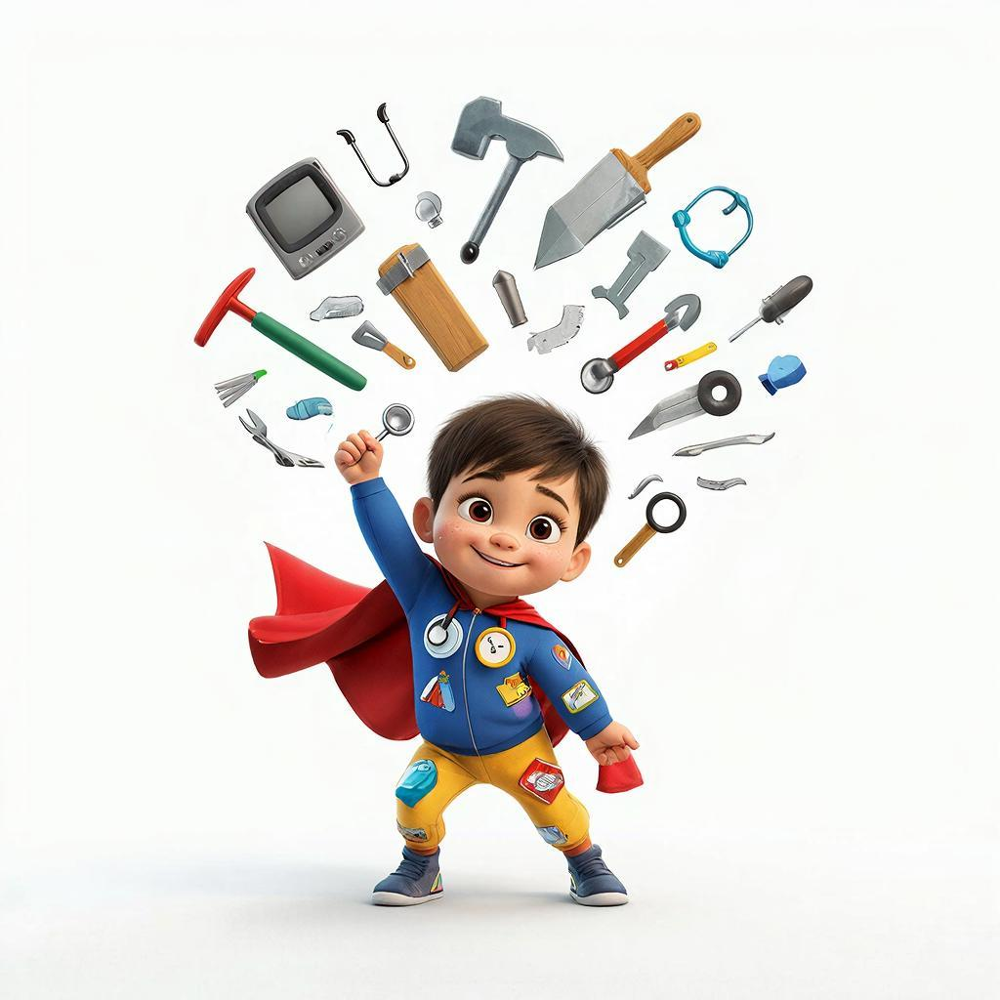

# Что такое профессия и как найти своё дело?

Представь, что мир — это огромный и сложный механизм, похожий на часы или гигантский конструктор LEGO. Чтобы всё работало правильно, каждая деталь должна быть на своём месте и выполнять свою задачу. У людей такие задачи называются **профессиями**.

**Профессия** — это не просто работа, которую человек делает каждый день. Это дело, которому нужно специально учиться, чтобы стать настоящим мастером. У каждого профессионала есть свой «багаж»: это его теоретические знания (то, что он прочитал в книгах) и практические [навыки](skills.md) (то, что он умеет делать руками или головой).

### Профессия, специальность или должность?

Иногда взрослые путают эти слова, но давай разберемся, в чем разница на примере медицины:

| Понятие | Что это значит | Пример |
| :--- | :--- | :--- |
| **Профессия** | Общее название твоего дела (род занятий). | [Врач](doctor.md) |
| **Специальность** | Твоя «суперсила» внутри профессии. | Стоматолог (лечит только зубы) |
| **Должность** | Твоё место в конкретной компании. | Главный врач больницы |

### Как получают профессию?

Никто не рождается сразу пилотом или [программистом](programmer.md). Путь к мастерству — это настоящее приключение, которое состоит из нескольких шагов:

1.  **[Мечта](dream.md)** — ты понимаешь, что тебе нравится помогать людям, строить дома или придумывать игры.
2.  **[Хобби](hobbies.md)** — ты начинаешь пробовать это дело по чуть-чуть (например, рисуешь персонажей или лечишь игрушки).
3.  **[Университет](university.md)** — ты поступаешь в специальное учебное заведение, где опытные учителя передают тебе секреты мастерства.
4.  **[Стажировка](internship.md)** — твоя первая проба сил в настоящем [офисе](office.md) под присмотром старших.

*(Подсказка для генерации картинки: Футуристичный светлый город, люди разных профессий — врач, инженер, дизайнер — вместе создают что-то новое, вокруг зелень и высокие технологии, стиль цифровой живописи, солнечная атмосфера)*

### Зачем выбирать профессию по душе?

Когда человек любит свою **профессиональную деятельность**, он идет на работу с радостью, как на праздник. Ему интересно решать сложные задачи, он постоянно растёт и в итоге получает за это хорошую [зарплату](salary.md). Но самое главное — настоящий мастер приносит огромную пользу всему миру!

Помни: в мире существуют тысячи дорог, и среди них обязательно есть та, которая создана специально для тебя!

---
**Автор:** Ильинский Никита

*Использованные нейросети: Gemini (генерация текста), Gigachat (генерация описаний изображений)*